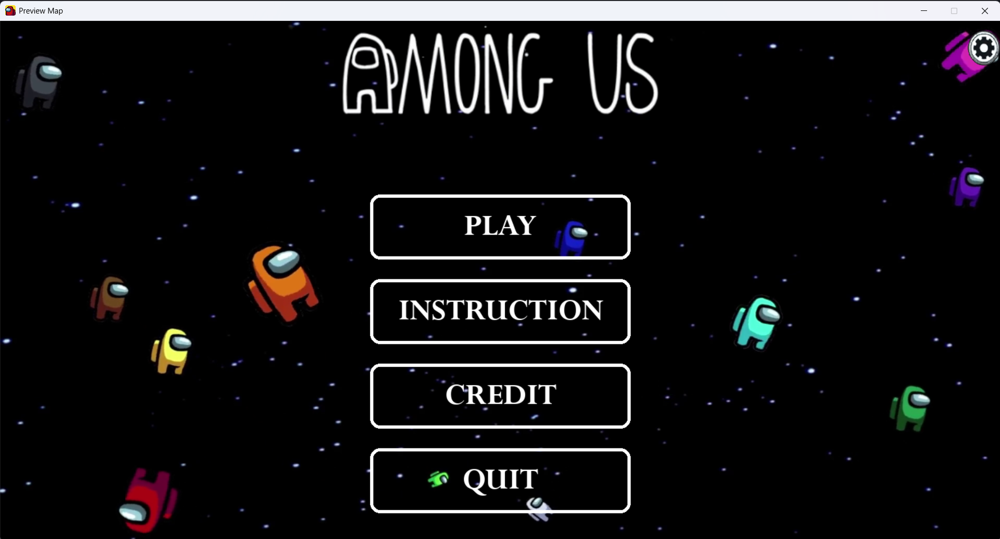
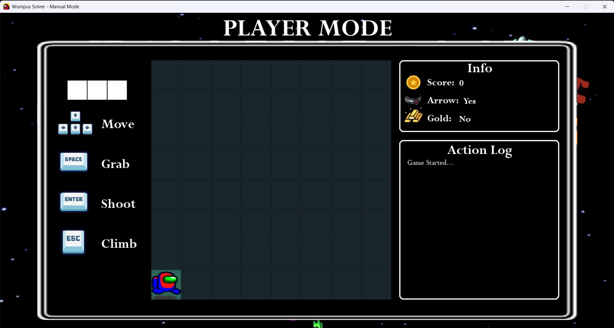
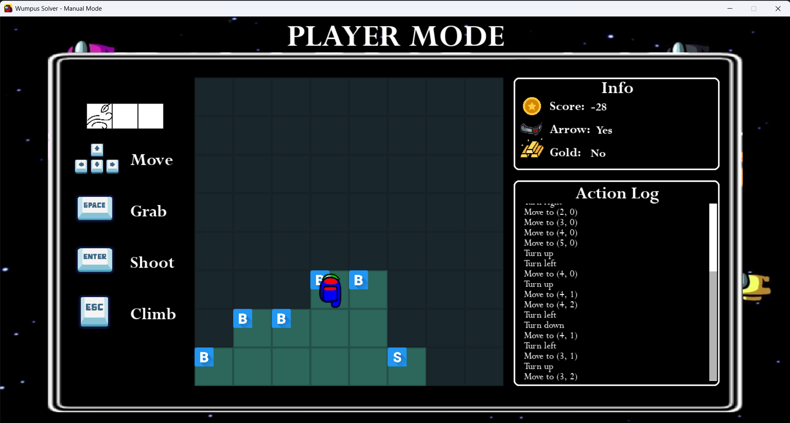
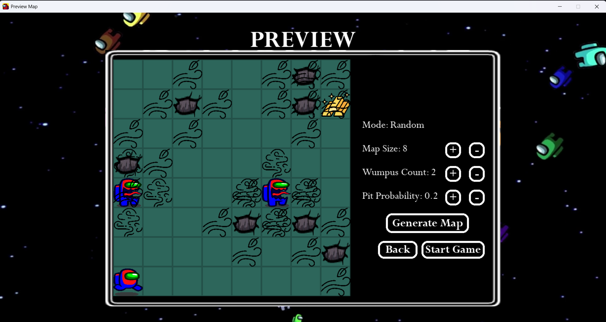
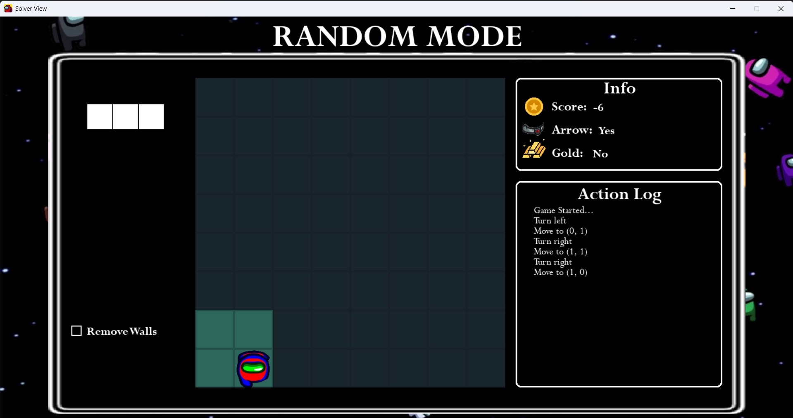
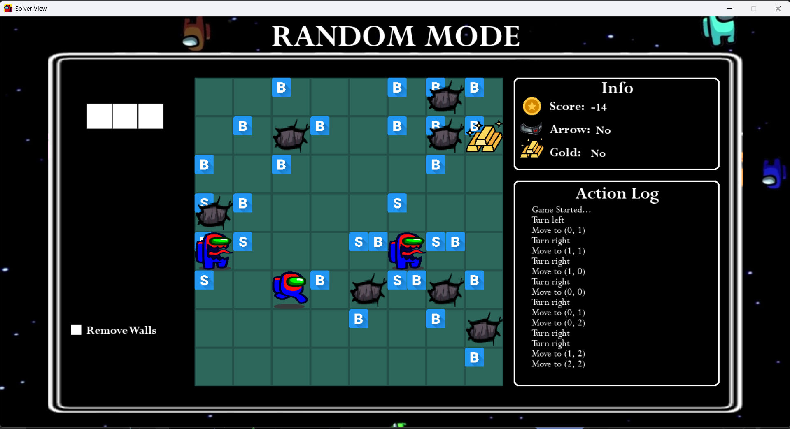
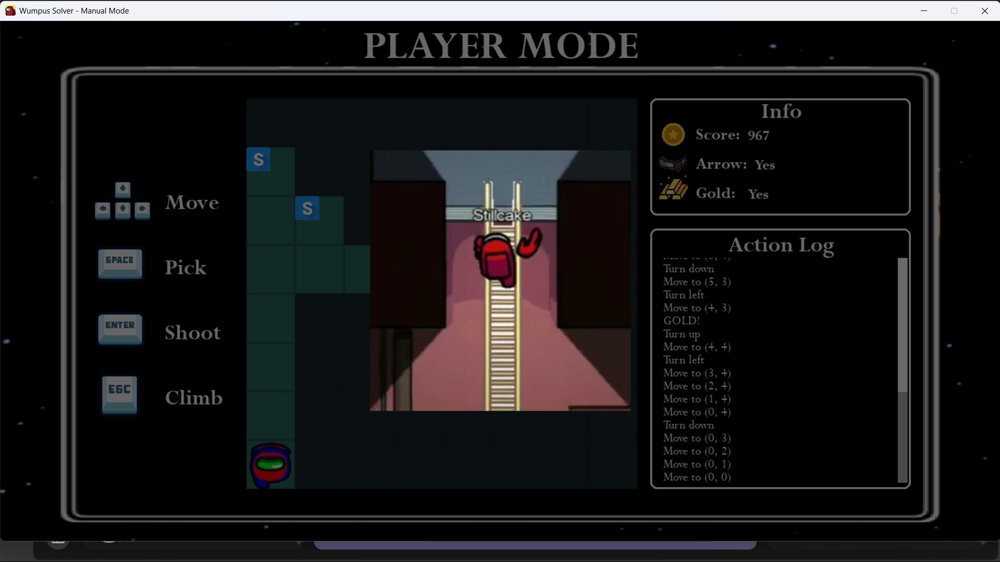
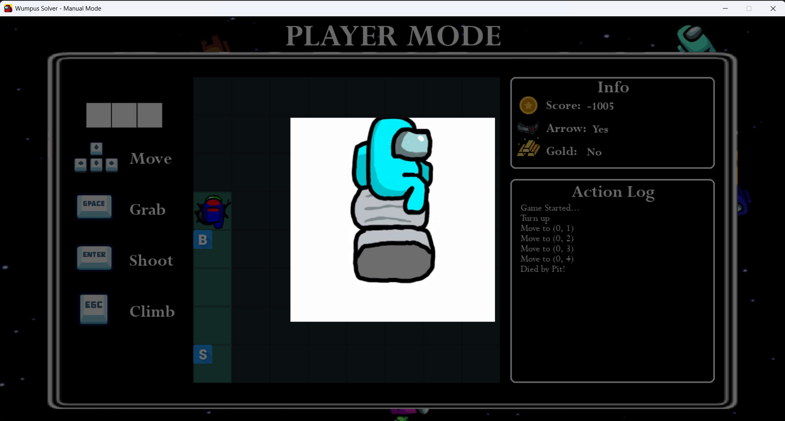
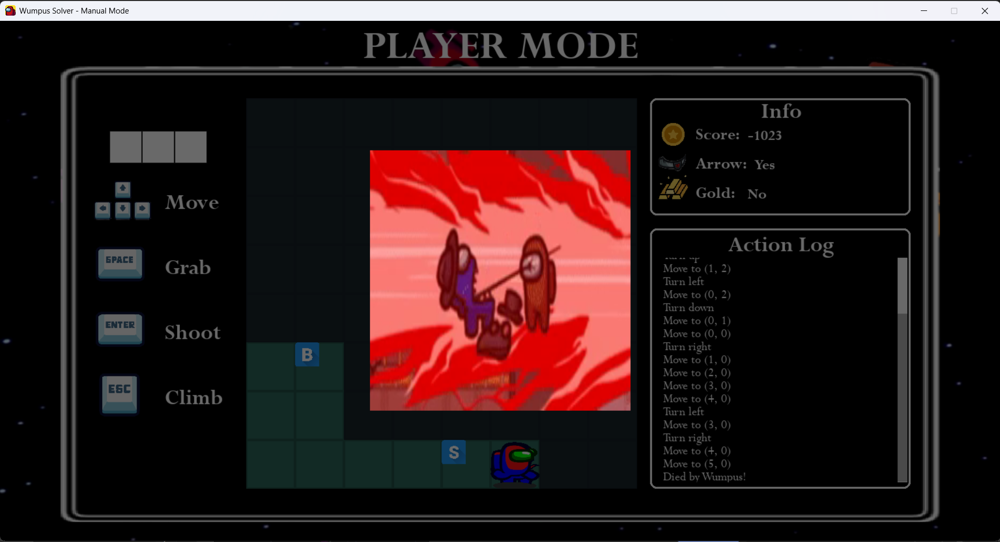

# Wumpus World Agent
[](https://www.python.org/)

An interactive simulation of the classic Wumpus World problem, featuring an intelligent AI agent that uses propositional logic and search algorithms to navigate its dangerous environment. The application, built with Python and Pygame, allows for real-time visualization of the agent's reasoning process, knowledge base, and decision-making.

---
## 📖 Table of Contents

- [Introduction](#-introduction)
- [Core Modules](#-core-modules)
- [Tech Stack](#-tech-stack)
- [Installation & Setup](#-installation--setup)
- [How to Use](#-how-to-use)
- [Credits](#-credits)

---

## 🎯 Introduction

This project was built to simulate and solve the classic Artificial Intelligence problem: **Wumpus World**. It's a complex environment that requires an agent to combine a Knowledge Base, Logical Inference, and Planning to achieve its goal.

This application serves as a powerful educational and demonstration tool to:
- **Simulate** a customizable Wumpus World, including map size, number of Wumpuses, and pit probability.
- **Visualize** how an agent builds knowledge about its surroundings from sensory percepts.
- **Understand** the practical application of logical inference rules to determine safe, dangerous, and uncertain cells.
- **Analyze** the agent's pathfinding strategy using the A* and BFS algorithm to find the safest and most efficient route to the goal.

---

## 🧠 Core Modules

The project is composed of several core modules that work together to create a complete, intelligent agent:

-   **Environment Simulator**:
    -   Randomly generates N x N maps with Wumpuses, Pits, and Gold.
    -   Provides percepts (Stench, Breeze, Glitter, Bump, Scream) to the agent based on its current state and location.
    -   Processes the agent's actions and updates the environment's state accordingly.

-   **Inference Engine**:
    -   Built from scratch based on the rules of Propositional Logic.
    -   Maintains a Knowledge Base (KB) to store everything the agent has learned.
    -   Infers the status of unexplored cells, classifying them as safe, containing a potential Wumpus, or containing a potential pit.

-   **Planning Module**:
    -   Implements the **A\* search algorithm** to find the optimal path.
    -   The A\* cost function considers not only the travel distance but also the calculated risk of each cell, guiding the agent along the safest possible route.

-   **Hybrid Agent**:
    -   Tightly integrates all of the above modules. At each step, the agent perceives its environment, updates its Knowledge Base, reasons about the state of the world, and plans its next action.

-   **Random Agent Baseline**:
    -   Serves as a simple benchmark to evaluate the performance of our main Hybrid Agent.
    -   This agent uses **Breadth-First Search (BFS)** to explore the map, expanding systematically from the starting point to all known safe cells.
    -   Unlike the Hybrid Agent, it does not use a sophisticated knowledge base for inference or risk assessment. It provides an essential point of comparison to demonstrate the value of the Hybrid Agent's intelligence.

-   **Advanced Setting: Moving Wumpus**:
    -   An advanced mode where the Wumpus is no longer stationary and can move randomly after a set number of agent actions.
    -   This challenges the agent to continuously update its knowledge and reassess risks in a dynamic, partially observable environment.

---

## 💻 Tech Stack

-   **Language:** Python
-   **Libraries:**
    -   `Pygame`: For building the graphical user interface (GUI) and visualizing the simulation.
    -   `OpenCV-Python`: (Optional: remove this line if not used).

---

## 🚀 Installation & Setup

To get the project running locally, follow these steps:

1.  **Clone the repository**
    ```sh
    git clone https://github.com/NguyenAn0808/wumpus-world-agent.git
    cd wumpus-world-agent
    ```
2.  **Install the required dependencies**
    ```sh
    pip install -r requirements.txt
    ```

3.  **Run the application**
    ```sh
    python main.py
    ```

---

## 🎮 How to Use

### 1. Start from the Main Menu

When you launch the application, you'll see the main menu.

-   To begin, click the **PLAY** button.
-   You can also view the game **Instructions**, check the **Credits**, or **Quit** the application.

<p align="center">
  
  <!-- TODO: Replace with your actual path to the main menu screenshot -->
</p>

### 2. Select Your Game Mode

After clicking **PLAY**, a pop-up will appear, allowing you to choose from four different modes.

-   **Hybrid Mode:** Watch the intelligent agent solve the puzzle.
-   **Random Mode:** Watch the baseline BFS agent solve the puzzle.
-   **Advanced Mode:** Challenge the Hybrid agent against a moving Wumpus.
-   **Player Mode:** Take control and try to solve the puzzle yourself!

<p align="center">
  
  <!-- TODO: Replace with your actual path to the mode selection screenshot -->
</p>

### 3. Play the Game in Player Mode

If you choose **Player Mode**, you take direct control of the crewmate. Your goal is to navigate the grid, find the gold, and return to the starting cell to climb out, all while avoiding pits and the Wumpus.

The interface provides everything you need to play:

-   **The Map:** The central grid where you move. You can only see the cells you have visited.
-   **Controls (Left):** Use your keyboard to perform actions:
    -   **Arrow Keys** to **Move** forward, turn left, or turn right.
    -   **SPACE** to **Grab** the gold when you are in the same cell.
    -   **ENTER** to **Shoot** your single arrow in the direction you are facing.
    -   **ESC** to **Climb** out of the cave (only works at the starting cell).
-   **Info Panel (Top Right):** Keep track of your current **Score**, whether you still have your **Arrow**, and if you've found the **Gold**.
-   **Action Log (Bottom Right):** Displays a history of your actions and the percepts you receive in each new cell (e.g., "You feel a breeze," "You smell a stench"). This is crucial for making safe decisions!

<table>
  <tr>
    <td width="50%" align="left">
      
    </td>
    <td width="50%" align="right">
      
    </td>
  </tr>
</table>

### 4. Using the AI Solver Modes (Hybrid, Random, & Advanced)
The flow for all three AI modes is identical, providing a consistent way to set up experiments and compare their performance.

#### 4.1. Configure and Preview the Map

After selecting an AI mode (e.g., **Random Mode**, **Hybrid Mode**, **Advanced Mode**) from the menu, you will be taken to the **PREVIEW** screen. This is your control center for setting up the challenge.

-   Use the `+` and `-` buttons to adjust the **Map Size**, **Wumpus Count**, and **Pit Probability**.
-   Click **Generate Map** to create a new random layout based on your settings. The full map, including the locations of all hazards and the gold, will be shown in the preview grid.
-   When you are ready, click **Start Game** to begin the simulation. You can also click **Back** to return to the main menu.

<p align="center">
  
</p>

#### 4.2. Observe the Agent's Journey

Once the simulation starts, you can watch the agent navigate the world. The interface offers two powerful viewing modes to help you analyze its behavior.

-   **Agent's View (Default):** By default, the screen shows the "fog of war" view. This displays only the cells the agent has visited, simulating its limited knowledge of the environment.

-   **Full Map View (Spectator Mode):** To see the complete picture, check the **Remove Walls** checkbox. This "spectator mode" reveals the entire map, including the locations of all Wumpuses, pits, and the percepts (Breeze 'B' and Stench 'S') in each relevant cell. This is incredibly useful for understanding *why* the agent makes certain decisions.

The **Info** panel and **Action Log** on the right provide real-time updates on the agent's score, status, and decision history.

<table>
  <tr>
    <td width="50%" align="center">
      
      <br>
      <em><b>Agent's View:</b> Only visited cells are visible.</em>
    </td>
    <td width="50%" align="center">
      
      <br>
      <em><b>Full Map View:</b> 'Remove Walls' is checked.</em>
    </td>
  </tr>
</table>

### 5. View the Outcome
Victory in the Wumpus World is achieved only by completing a specific sequence of actions: the player must first find and **Grab** the gold, then safely navigate back to the starting cell and **Climb** out.

Any other outcome results in failure. The most common and dramatic failures are illustrated below: falling victim to a hidden pit or being caught by the Wumpus. This immediate feedback is crucial for learning from mistakes and understanding the dangers of the Wumpus World.

<p align="center">
  
</p>

<table>
  <tr>
    <td width="50%" align="center" valign="middle">
      
      <br>
    </td>
    <td width="50%" align="center" valign="middle">
      
      <br>
    </td>
  </tr>
</table>

---
## 👥 Credits

This project was created and developed by:

-   GitHub: **[phucle04](https://github.com/phucle04)**
-   GitHub: **[NguyenAn0808](https://github.com/NguyenAn0808)**
-   GitHub: **[npmthu](https://github.com/npmthu)**
-   GitHub: **[hnhan2005](https://github.com/hnhan2005)**

Feel free to reach out with any questions or feedback!

---